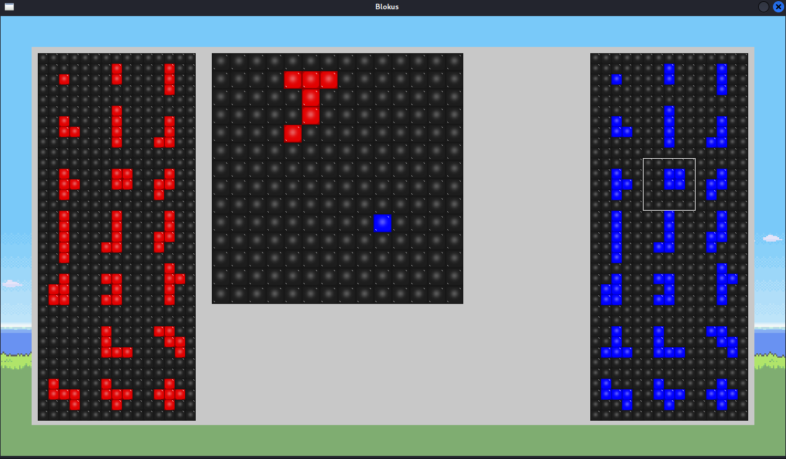
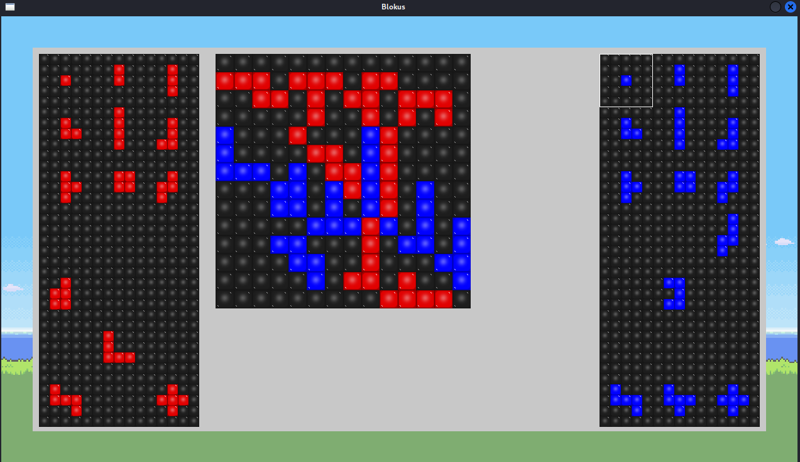

# Blokus Duo - Minimax AI

## Overview and Rules

This project was developed as part of my **engineering studies at ISIMA**. The goal of this project is to implement an **AI for Blokus Duo** using the **Minimax algorithm with Alpha-Beta pruning**. This project allowed me to explore game theory, decision trees, and optimization techniques.

Blokus Duo is a two-player strategy board game where players take turns placing uniquely shaped pieces on the board, ensuring that each new piece touches at least one other of their pieces **only at the corners**.

The game ends when one player has placed all their pieces or when no more valid moves are possible for both players. If both players cannot place any more pieces, the game ends, and the player with the fewest remaining pieces wins. In case of a tie (both players having the same number of pieces left), the game is declared a draw.

To simplify the game code and the implementation of the Minimax algorithm, we decided to assign each player a dedicated piece of size 1 tile by default. This piece is pre-positioned on the board for both players, ensuring that the starting conditions are standardized and easier to manage within the logic of the game. By including this pre-assigned piece, we eliminate the need for additional logic to handle edge cases that could arise during the first moves, allowing for a smoother integration with the Minimax algorithm. For a better understanding of how this piece is placed, please refer to the following [screenshots](#screenshots).

## Features

-   **Minimax AI with Alpha-Beta pruning**: Optimized decision-making process to explore the best possible moves.
    
-   **Graphical User Interface (GUI)** using **SDL2** for visualization.
    

## Technical Details

### AI Algorithm

The AI is implemented using **Minimax with Alpha-Beta pruning**, which efficiently prunes unnecessary branches in the decision tree, improving performance.    

### Implementation

The project is implemented in **C** with the following key components:

-   **`game.c`**: Handles game state and rules.
    
-   **`decisionTree.c`**: Implements Minimax with Alpha-Beta pruning.
    
-   **`blokus.c`**: Manages graphical rendering using SDL2.
-  **`init.c`**: Contains functions for initializing the game board, loading pieces from a file, and setting up the initial game state.
    
-   **`main.c`**: Manages the game loop, including event handling, rendering with SDL, and player interactions (AI vs. Human).
    
-   **`piece.c`**: Handles piece operations like displaying and rotating the pieces.
    

## Installation & Usage

### Prerequisites

Ensure you have **GCC** and **SDL2** installed. On Debian-based systems, install SDL2 with:

```bash
sudo apt install libsdl2-dev libsdl2-image-dev libsdl2-ttf-dev libsdl2-gfx-dev

```

### Compilation

The project uses a **Makefile** for compilation. To build the executable, run:

```bash
make

```

This will generate the `blokus.out` executable.

### Running the Game

To start the game, execute:

```bash
./blokus.out

```

## Screenshots




## Future Improvements

### Gameplay Enhancements
- Add a **victory screen** at the end of the game.
- Allow the player to **choose between red or blue** at the beginning.
- Make the **cursor appear in the middle** when selecting a piece.
- Display **keyboard controls** on the screen.

### Evaluation Function Improvements
- Improve the **evaluation function** to provide better AI decision-making.

### Graphical Layout Improvements
- Enhance the overall **visual arrangement** of the game elements.

### Minimax Optimizations
- Implement **multi-threading** to speed up AI computations.
- Optimize move search by **focusing on areas near existing pieces** instead of scanning the entire board. Implement **corner detection functions** to identify placement opportunities.
-  Improve efficiency of **Alpha-Beta pruning** by **Evaluating moves instantly** (before evaluating the whole branch) and then **Prioritizing high-value or low-value moves first** (depending on Min/Max turn) to increase early pruning chances.
- Avoid testing **small pieces at the beginning** by implementing a function that **filters available pieces** based on the number of turns elapsed.
- **Dynamically adjust the search depth** based on the game's progress.

## Key Bindings

- **Select/Deselect a piece**: `S`
- **Navigate through pieces and grids**: Arrow keys (`←`, `↑`, `→`, `↓`)
- **Place the piece**: `D`
- **Rotate the piece**: `R`
- **Abandon**: `A`


## Authors

- **Greg Fortias**
- **Alexandre Chassefeyre**
- **Manon Ménielle**